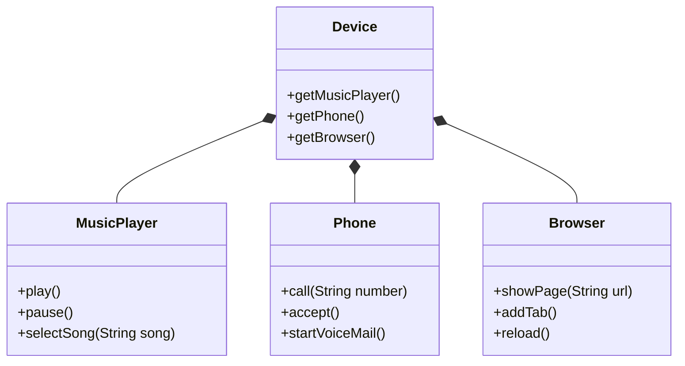
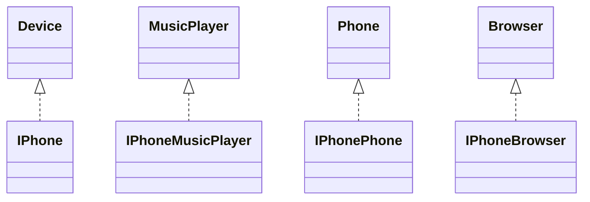

## Desafio 3 - iPhone e UML

### Exercício

- [Texto Original](Original%20README.md)

### Solução

Na minha implementação eu preferi deixar os métodos e classes em inglês e usar composição ao invés de deixar a class iphone implementar as interfaces.
Coloquei também a implementação iPhone em um pacote isolado. Assim tem espaço para um futuro pacote Android. Com a interface extra Device permite ao app mudar de android para iphone sem saber qual o aparelho está sendo utilizado.

> Device\
  getMusicPlayer(), getPhone(), getBrowser()

> MusicPlayer\
  play(), pause(), selectSong(String song)

> Phone\
  call(String number), accept(), startVoiceMail()

> Browser\
  showPage(String url), addTab(), reload()

### Interfaces

### Implementações

